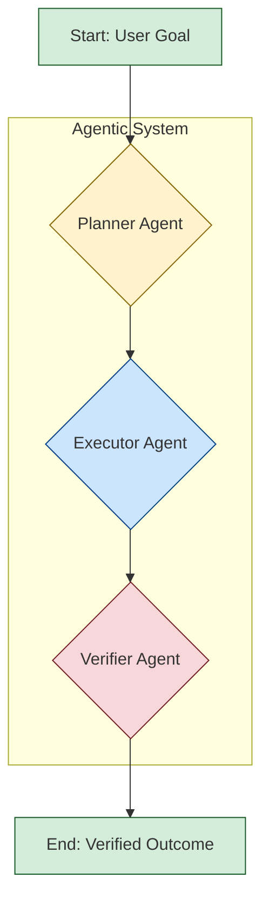

# The Verifier Agent: Mitigating Task Verification Failures in Agentic AI

[](https://opensource.org/licenses/MIT)

This repository contains the code, data, and analysis for the research paper on the "Verifier Agent," a lightweight, three-agent architecture designed to improve the reliability of agentic AI systems.

---

### **Abstract**

Agentic AI systems often fail silently because they lack a robust mechanism to verify task completion, a vulnerability we term the **Task Verification Failure Mode**. An agent may hallucinate a successful outcome, misinterpret results, or fail to execute a task, yet still report success. This research introduces a simple and robust architectural pattern, the **Verifier Agent**, to address this critical reliability gap. We propose a three-agent system (Planner, Executor, Verifier) where a dedicated, decoupled Verifier's sole responsibility is to check the Executor's output against the Planner's original intent. Through a benchmark of 20 diverse tasks, we evaluate this architecture against two common baselines (No Verification and Self-Verification) using both a lightweight local model (Phi ) and a state-of-the-art model (GPT-4o). Our results show that the Verifier Agent architecture **eliminates 100% of false positive failures** across both models, proving to be a significantly more reliable and trustworthy approach for developing autonomous AI agents.

---

### **1. The Problem: The Task Verification Failure Mode**

Autonomous agent systems are prone to a critical, often invisible, point of failure: the moment of task verification. Current systems, particularly those using a two-agent (Planner -> Executor) model or relying on the Executor to critique its own work, are unreliable. They frequently "fail silently" by:
* **Hallucinating Success:** Reporting a task as complete when it was not.
* **Misinterpreting Output:** Incorrectly assessing noisy or incomplete results from a tool.
* **Ignoring Errors:** Proceeding with a workflow even after an underlying tool or API call has failed.

This makes it difficult to trust autonomous agents in high-stakes environments.

### **2. The Solution: A Decoupled Verifier Agent**

We propose a simple architectural solution: a linear, three-agent workflow.



1.  **The Planner Agent:** Receives a high-level goal and breaks it down into a single, concrete task. Crucially, it also generates a "verification checklist" of conditions that must be met for the task to be considered successful.
2.  **The Executor Agent:** Receives the task from the Planner and uses a tool (in this case, a web search) to execute it. It is simple, unreflective, and passes its raw output forward.
3.  **The Verifier Agent:** This is the core of our contribution. It receives the Executor's raw output and the Planner's original checklist. Its sole job is to independently and meticulously check if the output satisfies *all* conditions on the checklist.

Our central hypothesis is that this decoupled verification process significantly reduces dangerous false-positive reporting compared to systems that lack this independent check.

### **3. Methodology & Experiments**

To test our hypothesis, we conducted a controlled experiment using a benchmark of 20 diverse tasks. Each task was run on three different systems:
* **Verifier System:** Our proposed Planner -> Executor -> Verifier architecture.
* **No Verifier Baseline:** A Planner -> Executor system that assumes success if no execution error occurs.
* **Self-Verifier Baseline:** A Planner -> Executor system where the Executor is then asked to critique its own output.

We ran the full benchmark twice: once using the local **Microsoft Phi ** model via Ollama, and once using the **OpenAI GPT-4o** model via API, to analyze the impact of model capability on architectural reliability.

### **4. Results & Key Findings**

The results, based on a manual ground-truth evaluation of all 120 experimental runs, are decisive.

#### **Performance Metrics (GPT-4o)**

| System Type | Accuracy | Precision | **False Positives** |
| :--- | :--- | :--- | :--- |
| **Verifier System** | 60% | 100% | **0** |
| No Verifier Baseline | 40% | 31% | **11** |
| Self-Verifier Baseline | 50% | 50% | **4** |

#### **Performance Metrics (Phi)**

| System Type | Accuracy | Precision | **False Positives** |
| :--- | :--- | :--- | :--- |
| **Verifier System** | 60% | 100% | **0** |
| No Verifier Baseline | 25% | 27% | **11** |
| Self-Verifier Baseline | 30% | 29% | **10** |

### **5. Outcomes & Insights**

1.  **The Verifier Architecture Eliminates False Positives:** The most critical finding is that the Verifier System achieved **zero false positives** across both models. It never reported a failed task as a success. This proves the architectural pattern is robust and effective at preventing the most dangerous type of agent failure.

2.  **Model Capability Affects Failure *Type*, Not Reliability:** The baseline systems did not become more reliable with a better model; they simply failed in more sophisticated ways. With Phi, they failed due to poor comprehension. With GPT-4o, they failed due to a lack of rigor, accepting "close enough" answers. This shows that even SOTA models require robust verification architecture.

3.  **The Verifier Is a "Cautious Expert":** The Verifier System demonstrates its reliability through a high number of **True Negatives**. It is exceptionally good at correctly identifying when a task has failed. This cautious approach is a feature, not a bug, making it suitable for applications where trustworthiness is paramount.

### **6. Repository Contents**

* `phi.py`: The evaluation script for running the experiment with a local Ollama model (e.g., Phi, Llama3).
* `openai.py`: The evaluation script for running the experiment with the OpenAI API (GPT-4o).
* `evaluation_results.csv`: The raw results from the Phi  evaluation.
* `evaluation_results_openai.csv`: The raw results from the GPT-4o evaluation.

### **7. Setup & How to Run**

#### **Option A: Running Locally with Ollama & Phi**

1.  **Install Ollama:** Follow the instructions at [https://ollama.com/](https://ollama.com/).
2.  **Pull the Phi Model:**
    ```bash
    ollama pull phi
    ```
3.  **Setup Python Environment:**
    ```bash
    python3 -m venv venv
    source venv/bin/activate
    pip install ollama ddgs
    ```
4.  **Run the Evaluation:**
    ```bash
    python phi.py
    ```

#### **Option B: Running with the OpenAI API (GPT-4o)**

1.  **Setup Python Environment:**
    ```bash
    python3 -m venv venv
    source venv/bin/activate
    pip install openai ddgs python-dotenv
    ```
2.  **Set API Key:** Create a file named `.env` in the root directory and add your OpenAI API key:
    ```
    OPENAI_API_KEY="sk-YourSecretKeyGoesHere"
    ```
3.  **Run the Evaluation:**
    ```bash
    python openai.py
    ```

### **8. Limitations & Future Work**

This study focused on single-step, atomic tasks to isolate and validate the Verifier concept. Future work should evaluate this architecture in complex, multi-step workflows where we hypothesize its value will be even more significant.

---

### **Citation**

If you find this work useful, please cite the upcoming paper: COMING SOON
